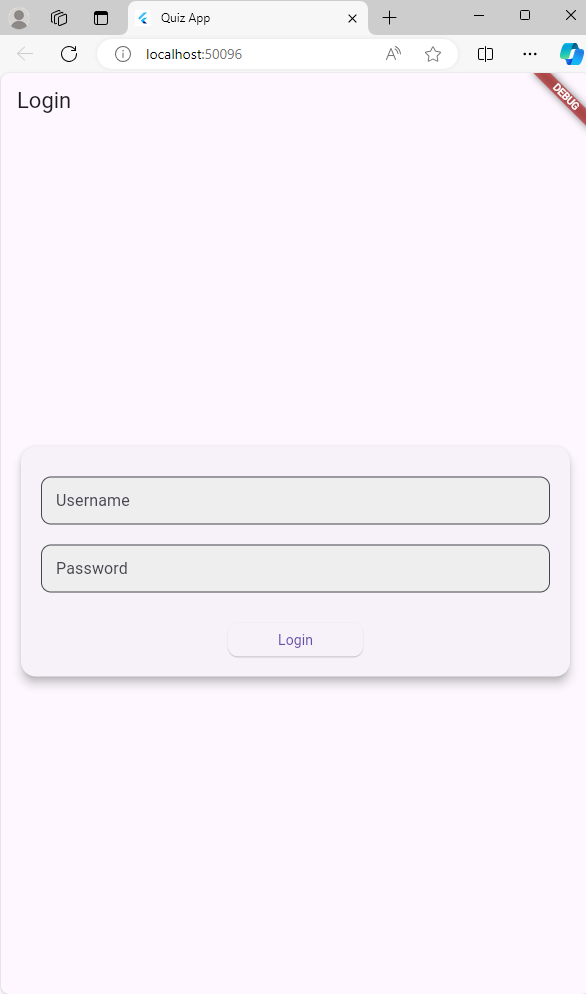
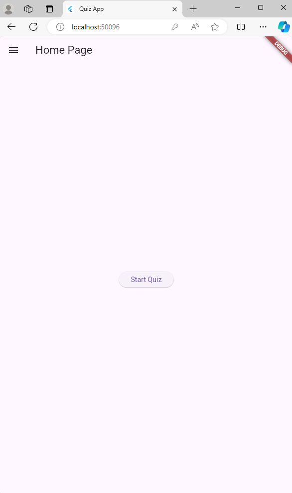
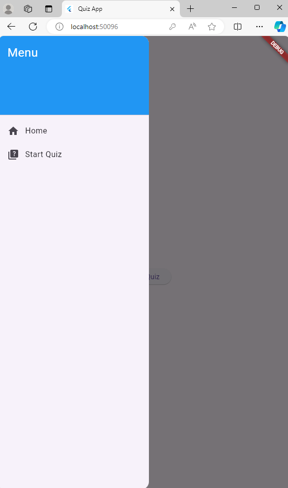
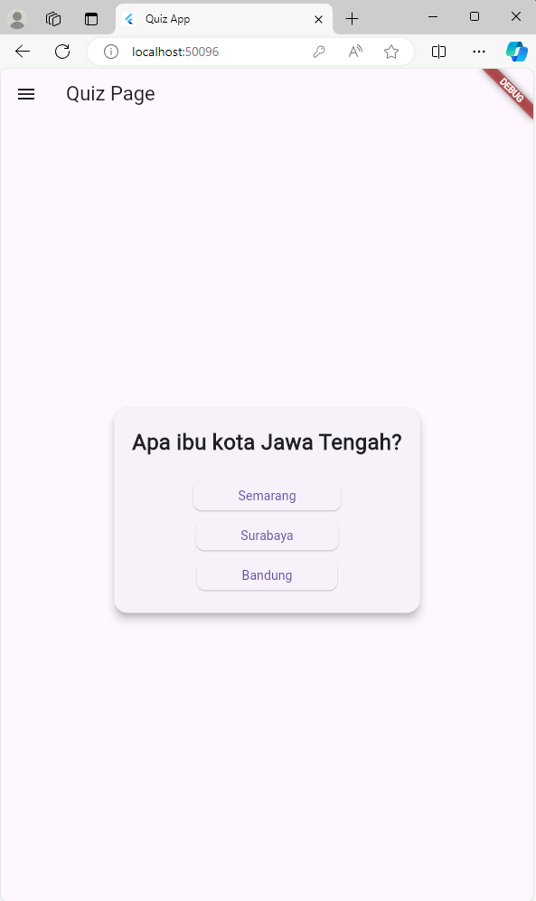
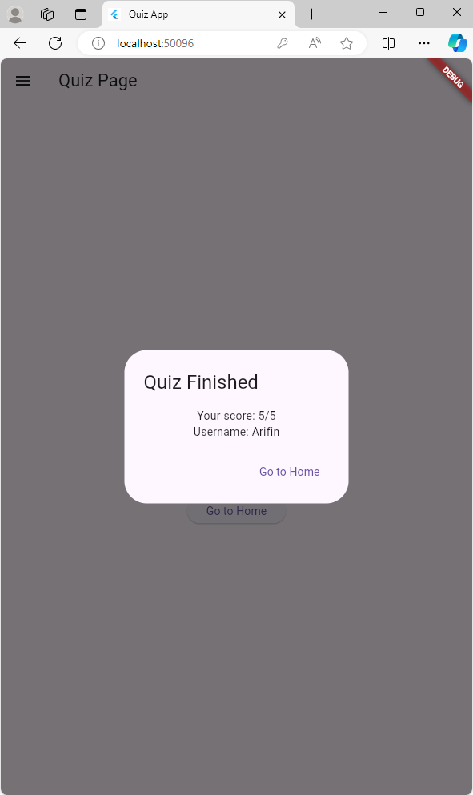

# labmobile3

Tugas Pertemuan 3 Praktikum Pemrograman Mobile Shift C

Nama    : Daniel Abdillah Arif
NIM     : H1D022055

# Penjelasan Source Code
1. Halaman Login
Pada halaman login SC-nya sama dengan pada Tugas 2, hanya merubah tampilan
2. Halaman Home Page
Pada halaman homepage hanya menambah tombol yang menuju ke halaman Quiz.
3. Side Menu
Pada Sidemenu menampilkan teks yang digunakan untuk menuju ke halaman lain, yaitu halaman home dan halaman quiz
4. Halaman Quiz
Pada halaman quiz, user akan mengerjakan lima soal yang ada kemudian akan ditampilkan skor dan username ketika sudah selesai mengerjakan soal.

- State Management dengan _QuizPageState

.png)

Di dalam kelas _QuizPageState, kita menyimpan daftar pertanyaan dalam variabel _questions, dan beberapa variabel seperti _currentQuestionIndex untuk melacak indeks pertanyaan saat ini, dan _score untuk menyimpan skor pengguna. namauser menyimpan nama pengguna yang akan diambil dari SharedPreferences.

- Memuat nama pengguna dengan _loadUsername
  
.png)

Fungsi _loadUsername digunakan untuk mengambil nama pengguna yang telah disimpan sebelumnya di SharedPreferences.

- Method _answerQuestion

.png)

Metode _answerQuestion memeriksa apakah jawaban yang diberikan benar. Jika benar, skor ditambah satu. Kemudian, indeks pertanyaan diperbarui, dan jika semua pertanyaan telah dijawab, hasil kuis ditampilkan.

- Method _showResult

.png)

Metode _showResult menampilkan dialog hasil kuis setelah semua pertanyaan dijawab. Ini menunjukkan skor dan nama pengguna, serta tombol untuk kembali ke halaman sebelumnya.

# Sreenshot
Halaman Login:

Halaman Home Page:

Side Menu:

Halaman Quiz:

Pop up Hasil Quiz:

